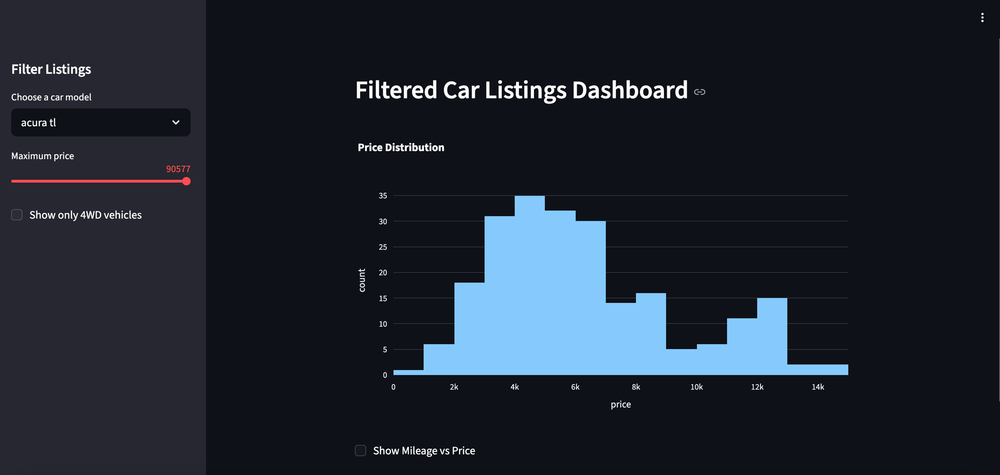
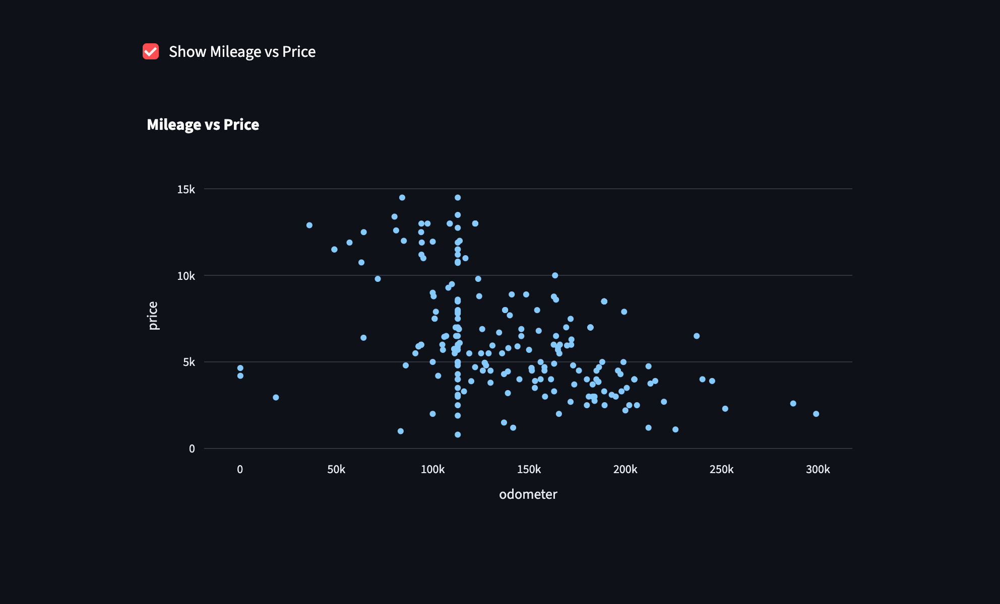

# Used Car Price Dashboard

## Overview
This project is an interactive dashboard that explores how different features affect used car prices.

## Dashboard Preview

## Visual Insights

### Mileage vs Price

## Goal
The goal was to analyze real-world vehicle listing data and understand how factors like mileage, model year, and fuel type influence pricing.

## What I Did
- Cleaned and prepared the dataset for analysis
- Explored relationships between key variables such as price, mileage, and year
- Built an interactive dashboard using Streamlit
- Created visualizations to make the data easy to explore

## Results
- Found that mileage and condition can impact price as much as the model year
- Built a dashboard that allows users to explore pricing trends interactively

- ## Key Insights
- Vehicle price decreases as mileage increases  
- Certain models retain value better than others  
- Price distribution shows clear clustering across vehicle segments  

## Tools Used
- Python
- Pandas
- Streamlit
- Plotly

## Live App
https://sdproject-z1td.onrender.com

## How to Run Locally

1. Clone the repository:
git clone https://github.com/loran83/used-car-price-dashboard.git

2. Install dependencies:
pip install -r requirements.txt

3. Run the app:
streamlit run app.py
